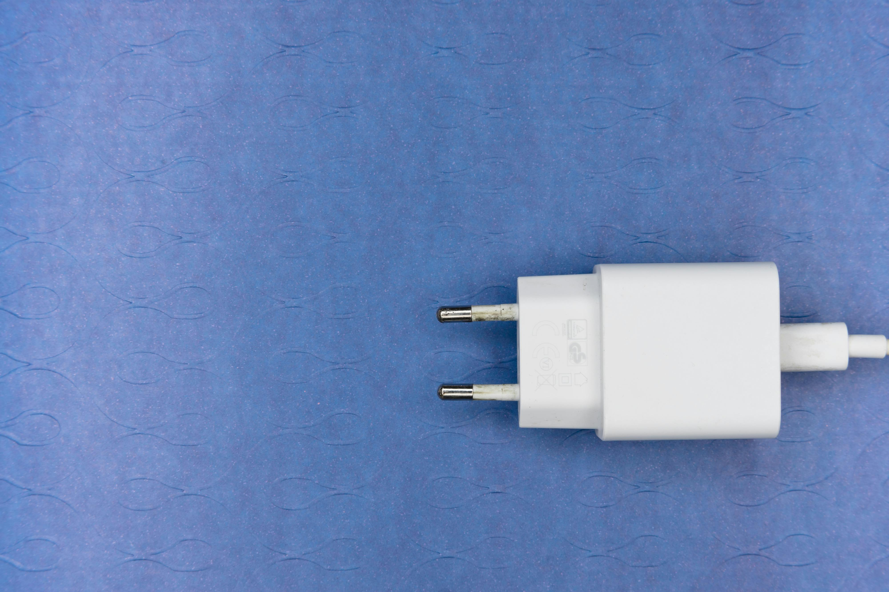
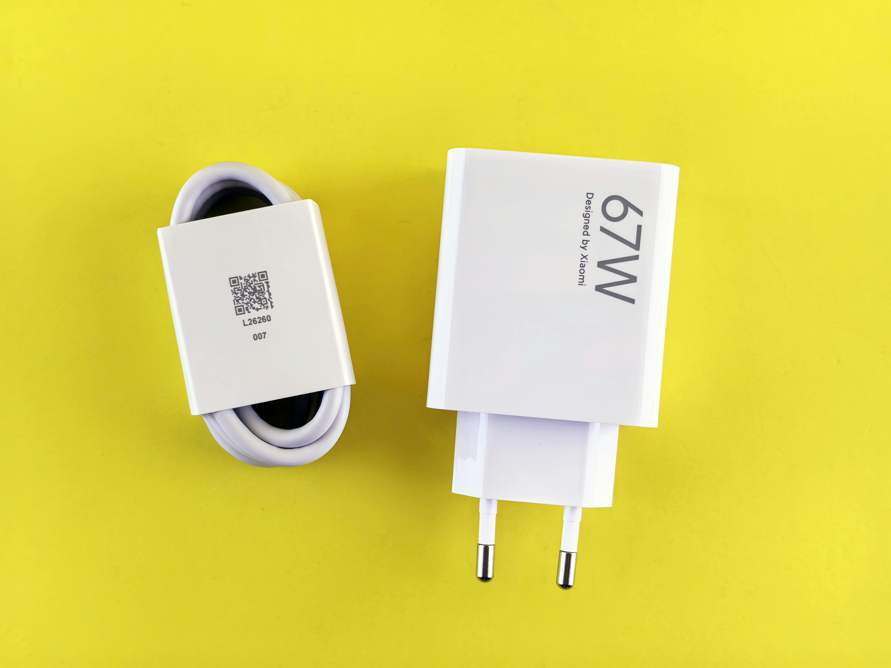
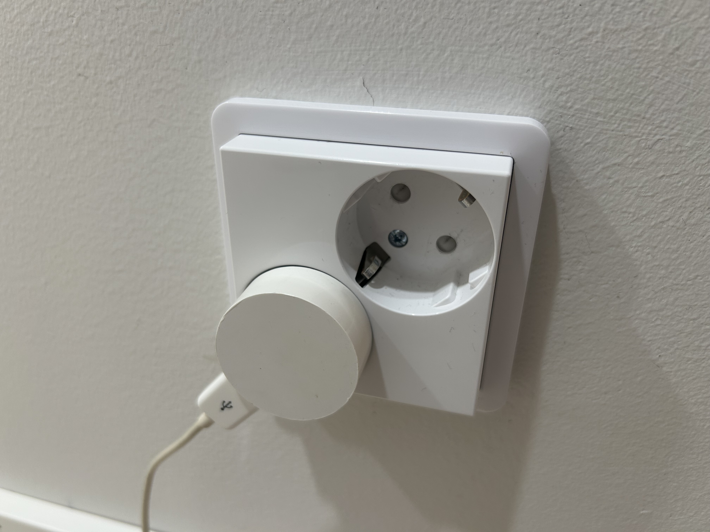
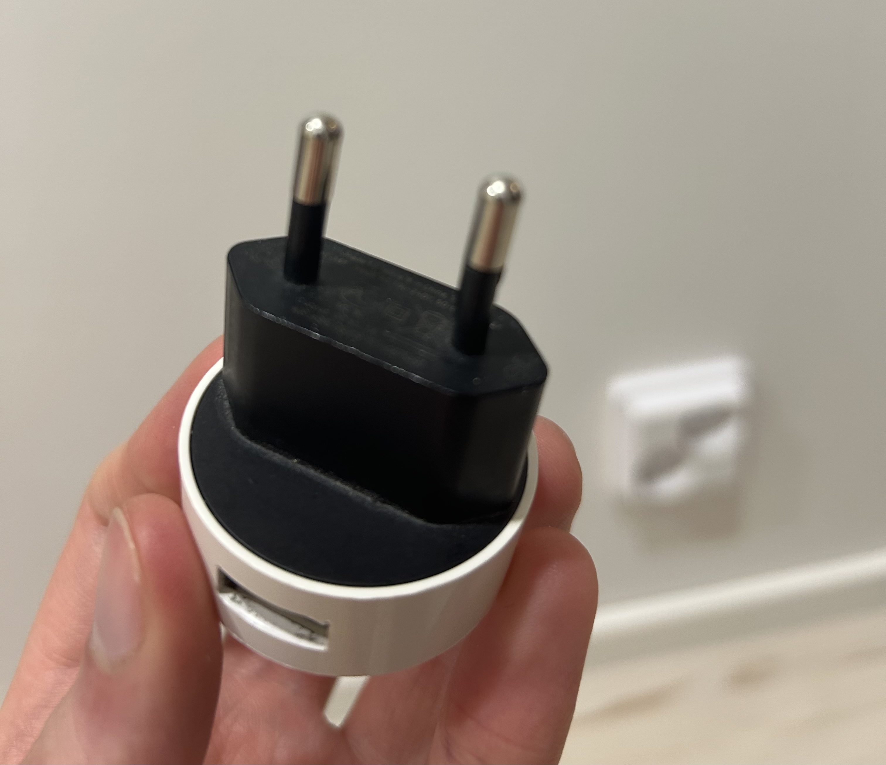

## **The Most Beautiful Wall Charger I Own (And Why It Matters)**

**Introduction: Yes, I'm Writing About a Charger**

Let’s be honest: most wall chargers are ugly. Big plastic bricks, clunky prongs, awkward angles - they do their job, but they’re not exactly elegant. You’ve probably never looked at one and thought: “Damn, that's a nice charger.”

I have. And I’m here to explain why.

---

### **The Problem With Most Chargers**

Most chargers are like this:

> 

> 

They’re:

- Bulky
- Visually intrusive
- Designed to be manufactured, not lived with

They hang off the socket, take up unnecessary space, and seem like something you just tolerate - not something you’d pick.

---

### **My Charger: A Small Circle of Joy**

Then I found _this_ one. Looking from online, it seems to be made by.. drum rolls.. NOKIA! It's a Nokia Salcomp AC 16E. It looks like while Nokia made some crazy phone designs back in the day, they have also made my favourite charger design in the Lumia era. Looking from online, technically it's not up to todays standards - it has 1A 5W speed. But for my iPhone 14, it works. It also has a USB-A port, while the world is moving into USB-C (thankfully!).

> 

> 

It’s:

- Perfectly round
- Minimal
- Just the size of the socket itself

There’s no branding. No sharp edges. No blinking lights. It disappears into the wall in the best way possible - and when it doesn't, it looks like it belongs.

Where did I get it? Well, someone left it to my house after a party _years_ ago. Tried to find the owner, couldn't. Maybe it was meant to be?

Looks like you can still buy this beautiful charger [from this Finnish site](https://vkauppa.fi/tuote/matkapuhelintarvikkeet/laturit-ja-tarvikkeet/nokia-ac-16e-alkuperainen-usb-plug-1a-compact-universal-fast-charger-white/). However, due to it's old age, I do not recommend it.

While researching the model of this charger, I also found out they have made a triangle-shaped one too: AC-16X, which is sold on [eBay](https://www.ebay.co.uk/itm/360519987368). That seems to also have the same technology, so can't recommend it either. But it is beautiful.

---

### **Why This Matters More Than It Should**

You might think: who cares? It's a charger. But there's something about functional objects being well-designed that makes daily life a little smoother - and a little nicer.

This charger:

- Doesn’t block nearby sockets
- Doesn’t fall out when the weight of the cable pulls on it
- Feels intentional, not industrial
- Matches the vibe of my room, not fight it

It’s one of those rare tech things that just _gets out of the way_. And that’s a feature, not a bug.

---

### **Form Follows Function, Even for Chargers**

There's something Bauhaus-adjacent here: minimalism not for trend, but for practicality.

The round shape isn't just cute - it solves problems:

- Compactness
- Fit
- Tactile simplicity

This is what happens when industrial design is treated with care. Not just: “make it small,” but: “make it make sense.”

---

### **Conclusion: Small Joys, Big Impact**

It’s easy to get obsessed with high-end gadgets. Phones, monitors, headsets. But sometimes, it’s the quiet tools - like a wall charger - that show you how good design should feel.

So yes. I have a favorite wall charger.  
And now, maybe, you do too.
