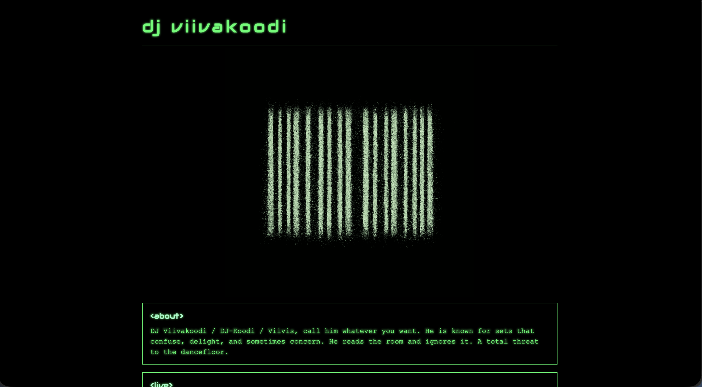

## Why I Wanted a Simple Static Site

I’d been meaning to create a small standalone page for my DJ project for a while. Nothing fancy — just a clean one-page site where people can find the name, a short description, and links. I already wrote about how I got into DJ’ing in an earlier post, and this felt like a natural extension of the hobby.

I didn’t want to spend weeks designing something big or setting up a backend. Static sites fit this situation perfectly:

- no logins
- no forms
- no dashboards
- nothing that needs a database
- nothing that updates itself

Just a simple page that loads fast and costs almost nothing to keep online.

## Why a Static Website Still Makes Sense

People often jump straight to frameworks or headless CMS setups, but for small projects you usually don’t need them. Static sites are still one of the easiest ways to get something online:

- **Cheap** — only the domain costs money
- **Fast** — almost instant load times
- **Reliable** — nothing really breaks
- **Simple to maintain** — edit HTML/CSS and push changes

My portfolio and blog run as a static site too, though built with Astro. For the DJ page, I wanted something even lighter. Pure HTML and CSS felt refreshing.

## Choosing a Domain That Doesn’t Make Life Complicated

The domain is the step that tends to slow people down. There are endless TLDs and options, and it’s easy to overthink.

I try to follow a simple rule:  
**short, easy to type, and connected to the project.**

`.com` is usually the best pick, but short `.com` names are almost always taken — especially five or six-letter ones. That’s why my main site runs on `.net`.

For the DJ project, I first looked at:

- djviivakoodi.com
- dj-koodi.com

Both were available, but neither felt clean. I usually go by “would I want to say this out loud?” and both of those fail that test.

Then I tried **viivis.com** — a short nickname I use. Six letters, easy to remember, and somehow still not taken. That made the decision easy.

I bought it on **Porkbun**, which has slowly become my default place for domains. Their pricing is clear, the UI is straightforward, and they don’t try to upsell everything.

With a small discount I found through Google, the domain cost **10.08 USD** for the first year. Just over ten euros for my own URL. That’s all I needed to get started.

## Building the Page Itself

The site design is intentionally simple — a one-pager with a small nostalgic matrix-style look. Nothing serious, nothing meant to impress anyone. It’s the internet equivalent of a business card.

My workflow looked like this:

1. I asked ChatGPT to generate a basic layout and some CSS.
2. I tweaked the text to fit the vibe I wanted.
3. I adjusted spacing, colors, and fonts by hand.
4. I added OG tags so links look good when shared.
5. I removed all the unnecessary code and kept it minimal.

If you want something more structured, Astro would’ve made routing, assets, and metadata easier. For this site, plain HTML was faster.

Here’s how the final thing looks:

Screenshot of the site.

## Hosting the Static Site on GitHub Pages

GitHub Pages is perfect for this kind of project. It’s free, fast, and predictable. If your site is static, you don’t need anything more.

My workflow was simple:

1. Create a public GitHub repo
2. Add the HTML/CSS files
3. Enable GitHub Pages in the repository settings
4. Choose the branch you want to deploy
5. Wait a few seconds for it to build

The only downside is that GitHub Pages requires public repos on free plans. For a hobby page, that’s fine. If you ever need something private, a cheap VPS would be an alternative, but it comes with more steps.

### Connecting the Porkbun Domain

The Porkbun → GitHub Pages setup is quick if you follow GitHub’s own guide.

You need to add two things:

- A CNAME record pointing to `username.github.io`
- A few A records for GitHub’s IP addresses

After adding them:

- wait for DNS to settle
- GitHub will detect the configuration
- Porkbun automatically creates the SSL certificate
- you enable HTTPS on GitHub Pages

And that’s it. No hidden steps. No surprises.

## Adding the Site to Google Search Console

Once the site was online and DNS was stable, I went into Google Search Console and added **viivis.com**.

It requires a small TXT record for site verification. Porkbun makes that simple. After that, Search Console starts tracking impressions, coverage, and search queries.

I’m not expecting heavy traffic — it’s a niche hobby page — but it’s still fun to see how people find it. Even small search data can be interesting, especially for personal projects.

## Total Cost and Time

This is what the whole thing came down to:

- **Domain:** 10.08 USD for the first year
- **Hosting:** free with GitHub Pages
- **Time spent:** a couple of hours per evening, two evenings total

The first evening went to:

- choosing the domain
- buying it
- building the first version
- pushing it to GitHub

The second evening was for:

- waiting for SSL
- adding OG tags
- cleaning up the layout
- fine-tuning small details

After that, the site was online.

## What I Learned From Doing This Again

Even though I’ve built plenty of websites, doing something extremely simple reminds me how effective static sites still are.

A few thoughts:

- The fastest way to ship something is still plain HTML/CSS.
- Buying a domain is the only real cost.
- GitHub Pages continues to be one of the easiest hosting platforms.
- The whole “deployment pipeline” is just a `git push`.
- You don’t need a full framework for small projects.

Publishing something small gives the same sense of progress as publishing something big — just with far less overhead.

## Final Thoughts

If you need a simple site for a hobby, portfolio, landing page, or small standalone project, a static setup is worth considering. It’s fast, cheap, and doesn’t require maintaining a backend. Most people overestimate what they need when starting out.

This approach gave me a lightweight page with its own domain, costs almost nothing to keep online, and took basically no time to build.

And if you want to check it out, here’s the final result:  
**[viivis.com](https://viivis.com)**
