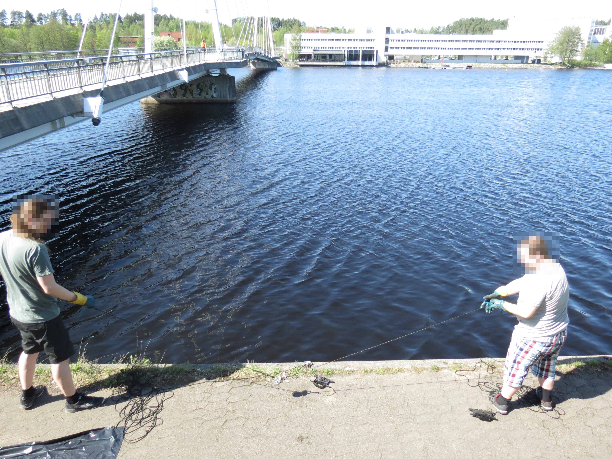
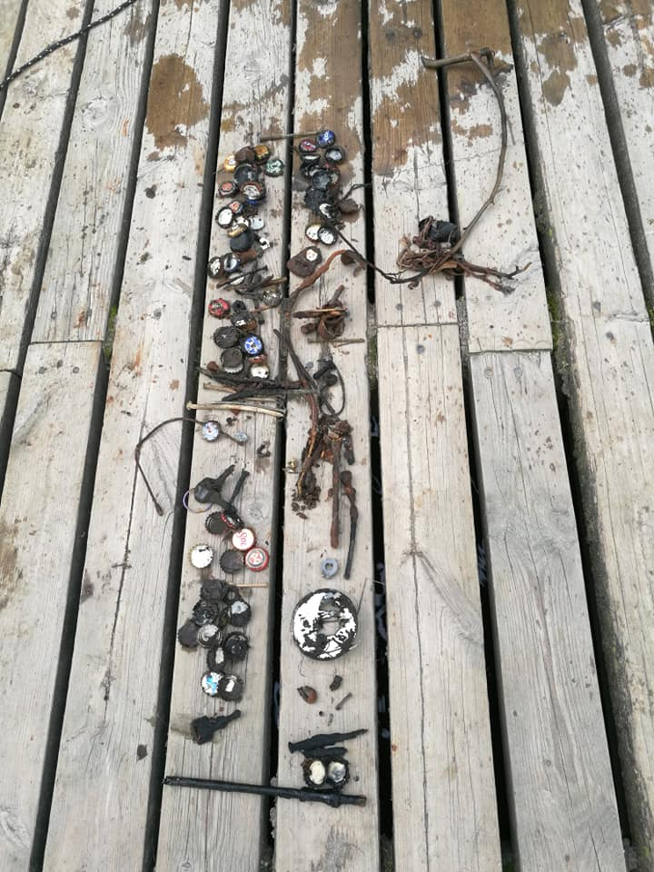
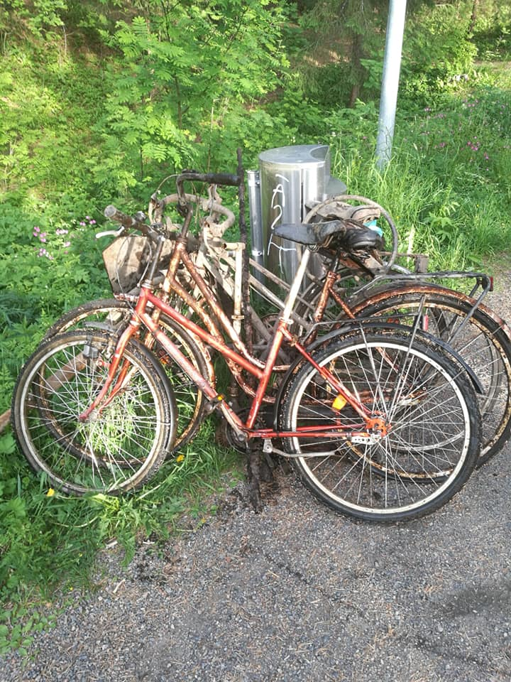
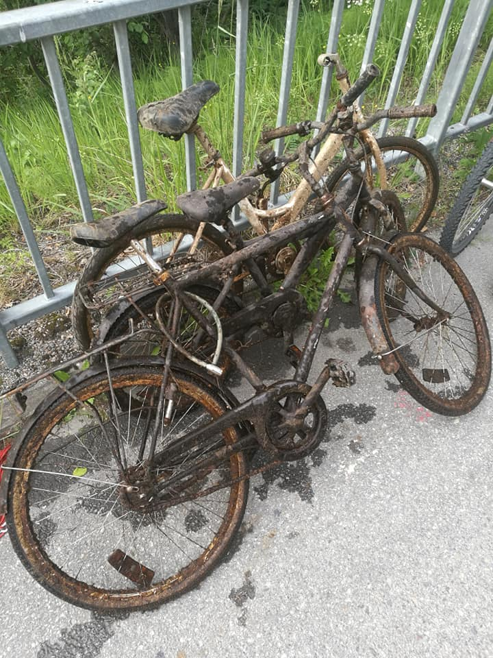
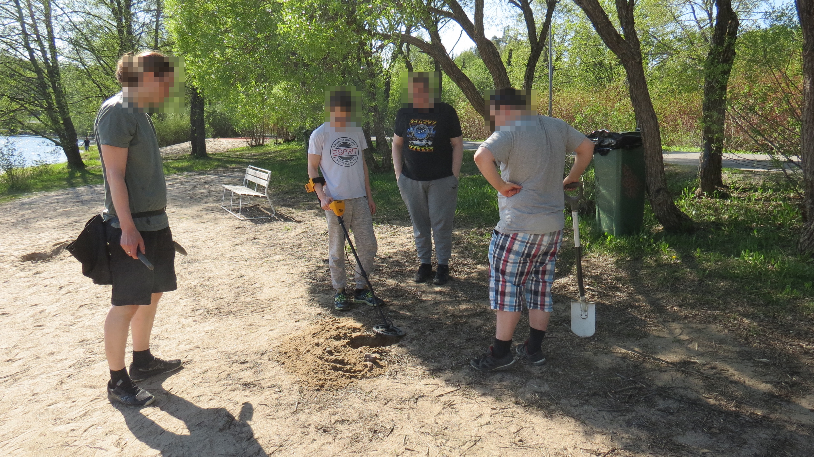

## How I Got Into Magnet Fishing

I first heard about **magnet fishing** years ago when reading about it online: the idea of pulling forgotten metal treasures from lakes and rivers fascinated me.  
But I didn’t start until a few friends founded an association called _Ironic Professionals ry_ and asked me to join. That was the push I needed.

Soon I was not just fishing but also part of the organization: first as a **board member**, then spending a couple of years as **secretary**.

Although the association was eventually dissolved in 2025 due to a lack of members and high banking costs, the hobby itself remained. We still go out magnet fishing together, and honestly, it’s even more fun now without the paperwork and responsibilities.

---

## What You Need for Magnet Fishing

Starting out doesn’t cost much, but a few essentials make a big difference:

- 🧲 **A strong fishing magnet** — You can find these from EU-based magnet stores online. These days, even Finnish hardware chains like **Puuilo** and **Biltema** sell suitable magnets.
- 🧤 **Rubber gloves** — Keeps your hands clean and safe.
- 🪢 **A strong rope** — To secure your magnet (and yourself from losing it).
- 🗑️ **Trash bags** — For proper disposal of what you pull out.
- 💎 **A loot bag** — For the treasures you may find.

Optional but useful: waterproof boots and a small metal brush for cleaning your finds.

Magnets stuck together

---

## How Much Does It Cost?

A good-quality magnet and rope set usually costs around **€50–€100**, depending on strength. Gloves and trash bags add only a few euros. Compared to many other hobbies, magnet fishing is affordable and you can do it almost anywhere with water. If you are okay with not so quality magnet, you can get it for 30 euros, but it might not catch so much loot.

---

## My Best (and Strangest) Finds

Over the years, we’ve pulled up everything from small screws to big surprises. Some of the most memorable include:

- 🎮 A **PlayStation 4**
- 🔪 A **chainsaw**
- 👙 A pair of **women’s underwear**, which had caught on a metal wire underwater

We’ve also found countless **bicycles**, tools, and coins. Every trip is a mix of treasure hunt and environmental cleanup.

Some loot. Mainly bottle caps and miscellaneous stuff.

Bicycles from one afternoon fishing session.

Even more rusty bicycles from another session.

---

## Safety and Environmental Tips

Magnet fishing is not just fun: it’s also good for nature. By removing metal junk from lakes and rivers, we help keep waters cleaner and safer.  
Still, safety comes first:

- Always **check local regulations** before fishing: some areas, like harbors, may have restrictions or hidden metal poles where magnets easily get stuck.
- If you find **old ammunition or weapons (e.g., WWII-era)**, don’t touch them. In Finland, **contact the police immediately**.
- Never leave your finds behind: dispose of them responsibly!

Sometimes our magnets got stuck so badly that someone had to **swim** to retrieve them. It’s part of the adventure, but always assess risks before diving in. Sometimes they get so stuck that we have to leave them there. That's life.

---

## Who Should Try Magnet Fishing?

This hobby is perfect for anyone who enjoys **treasure hunting, outdoor activity, or helping the environment**. You can do it alone or with friends, and it doesn’t require special skills, just curiosity and patience.

If you’re in the **Jyväskylä area**, feel free to reach out: I’m always happy to go magnet fishing with newcomers or show the basics.

We also did metal detecting with metal detector occasionally, and you wouldn’t believe how many screws, coins, and bottle caps we found on beaches. It goes hand in hand with magnet fishing: same excitement, different kind of hunt. The downside is that metal detectors are more expensive, and if you have only one, you may end up taking turns on the detecting itself.

Metal detecting with friends.

---

## Common Magnet Fishing Questions (Mythbusting)

### 🟡 Will a fishing magnet pick up gold?

No: **gold is not magnetic**. Fishing magnets only attract ferromagnetic materials like iron, nickel, and cobalt. You won’t catch gold, silver, or copper coins with a magnet.

### ❤️ Is a magnet harmful to the heart?

For most people, **magnets are not harmful**. However, those with **pacemakers or implanted medical devices** should avoid strong magnets, as they can interfere with the device’s function. Always consult a doctor if unsure.

### 📱 Will a fishing magnet ruin my phone?

It can, if you bring it close enough. **Strong neodymium magnets** can **damage phone components**, especially the compass sensor and magnetometer. Keep your magnet several centimeters away from phones, bank cards, and hard drives.

### 💶 Which euro coins are magnetic?

Some euro coins contain steel cores and are **slightly magnetic**, especially **1-, 2-, and 5-cent coins**. Higher-value coins (10 cents and above) are mostly made from non-magnetic alloys, so they won’t stick to a magnet. We've made some euros from all the 5-cent coins we have found over the years.

---

## Final Thoughts

Magnet fishing is a mix of **treasure hunting, environmental work, and outdoor fun**. It’s a hobby that gives back: you never know what you’ll find, but you’ll always leave nature a little cleaner.

If you’re curious, grab a magnet, a rope, and a friend, and head to the nearest lake or river. Who knows what’s waiting at the bottom?
