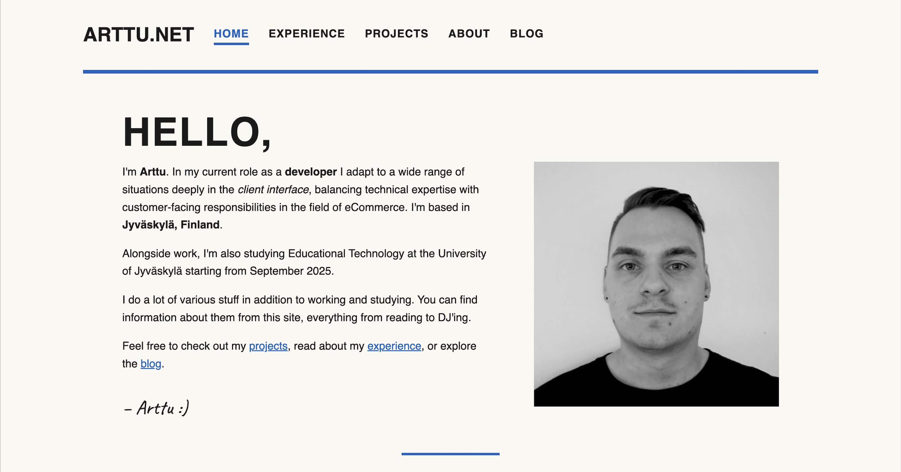
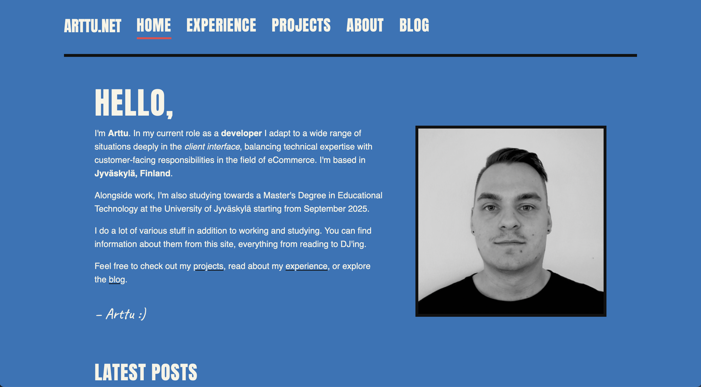
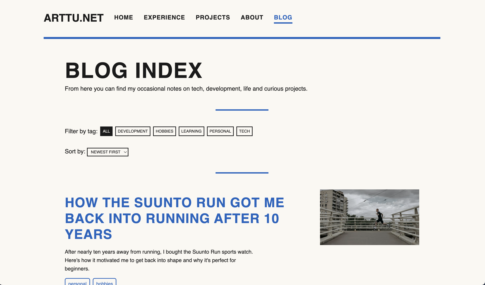
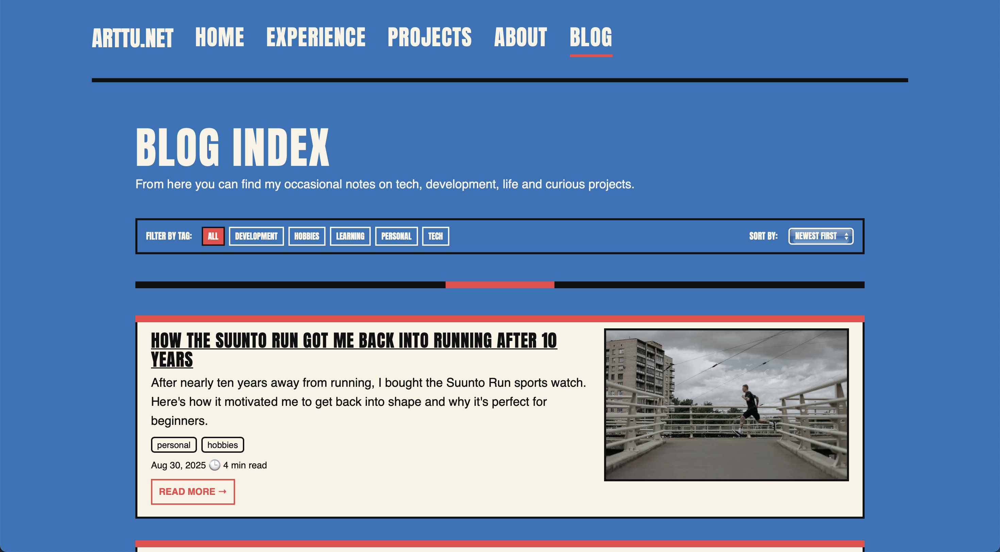
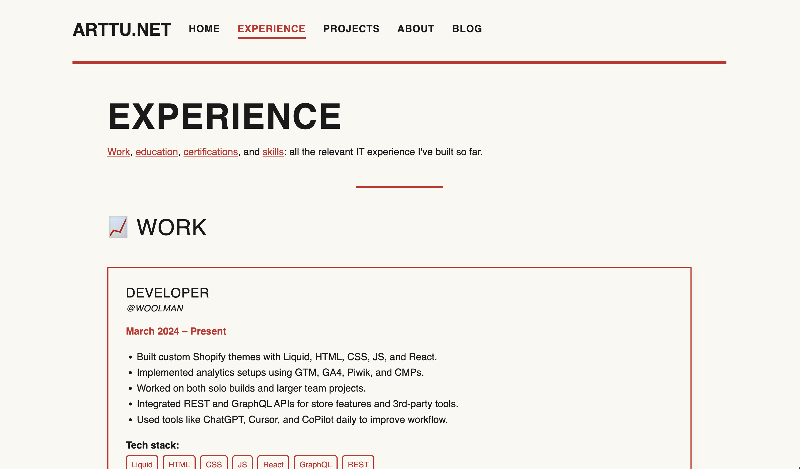
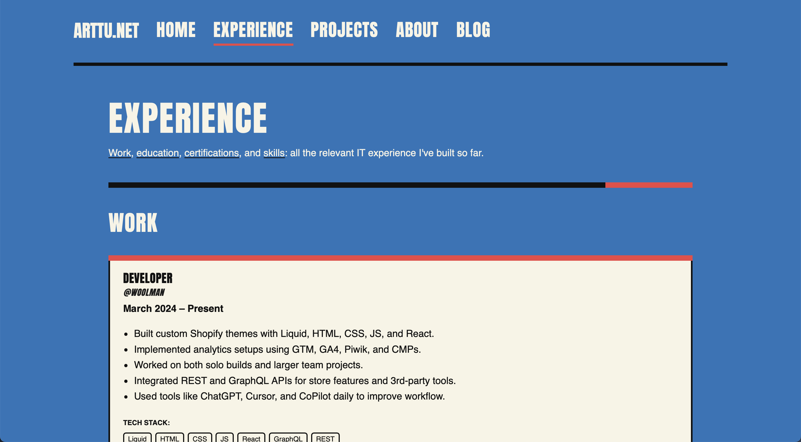

## Introduction

Yes, I did it again. I changed the design of my website.

Why? Because the old version didn’t feel like me. It looked minimal and tidy, sure, but also bland. It was a design that didn’t represent me as a person or the way I want to present myself online. I want to be proud of what I publish, and if I can’t even get excited about my own website, then what’s the point?

This post is a look into **why I redesigned the site (again), what inspired the new design, how I built it, and what’s next**.

---

## Why the Redesign?

The [old design](http://localhost:4321/blog/portfolio-redesign-bauhaus/) was functional but soulless. It had the classic portfolio vibe: calm, white, minimal. But when I looked at it, I didn’t see myself. If you can do any design you want on the World Wide Web and it presents YOU, why settle?

I wanted something bolder, more personal: something that communicates what excites me visually.  
That’s where the overhaul started.

---

## The Idea Behind the New Design

In my head, the starting point was wild:  
_"Akira meets superheroes meets fighting games meets Katsushika Hokusai meets modern poster design."_

It sounds chaotic, but the vision slowly condensed into something coherent:  
a **poster-like, bold design** with strong typography and a vibrant color palette. And I absolutely love the hover effects on cards!

Here’s how I defined it in my brand guide:

- **A bold, poster-inspired UI** that blends Japanese woodblock colors (blue + cream + vermilion) with arcade/fighter-select shapes (thick outlines, stamps, flags).
- **Typography does the heavy lifting**—components stay simple and graphic.
- **Brand traits:**
  - _Brave_ → oversized type, strong blocks of color, visible edges.
  - _Readable_ → calm cream backgrounds, generous spacing.
  - _Playful-serious_ → arcade-like hover states, but no distracting gimmicks.

In short: I wanted my website to look like a poster you could almost hang on a wall.

---

## From Vision to Reality

Having a vision is one thing. Turning it into a usable website is another.

I spent hours hunting for inspiration, sketching ideas, and experimenting with layouts that wouldn’t hurt the eyes or ruin readability. I had a clear picture in my head, but bringing it into the browser took time.

AI also helped. ChatGPT was my planning partner: I bounced ideas, refined concepts, and tested out how far I could push certain elements without making the site a mess.

I mentioned superheroes earlier. I am still on the verge of thinking "does it look too much like Captain America was splattered into the site, with a hint of cream?" but I guess that is okay. I love the colors.

---

## Development Process

Once the design direction was set, the development itself was fast.

- The site already had a solid base built with **Astro**.
- Hosting is still on **GitHub Pages**. It’s not perfect (there are things I’d love to do on a VPS), but the **CI/CD pipeline with Astro + GitHub Pages is smooth and fast**. Emphasize on fast, because time is limited between work and studying + I want to be able to do my own fun activities too.
- The main work was in **deciding fonts, colors, and styling**, documenting them into a small **brand book / style guide**, and then translating that into CSS.

That’s it. Suddenly the bland site felt alive.

---

## Old vs New

A redesign is best shown, not told. Here are comparison shots of the old and new site:

- **Front page:** old vs new

- **Blog index:** old vs new

- **Experience page:** old vs new

The difference is night and day. The new design feels like me. Content stays the same, but representation is drastically different.

---

## What’s Next?

The work doesn’t end here. Design is never “done.” I’ll keep tweaking, refining, and experimenting. I already see some things I want to tweak a bit, and new functionality is on my mind.

But for now? I’m genuinely happy with the outcome.  
My site finally feels personal, bold, and something I can be proud to call mine.

---

## Final Thoughts

If there’s one takeaway from this redesign, it’s this: **don’t settle for a design that doesn’t feel like you.** Even if it means starting over (again). Your personal site should reflect who you are: not just follow trends.

And if that means “Akira meets Hokusai meets fighting games,” well… then that’s exactly what it should be. If it works, it works. If it doesn't - reiterate!

Let me know what you think :)
